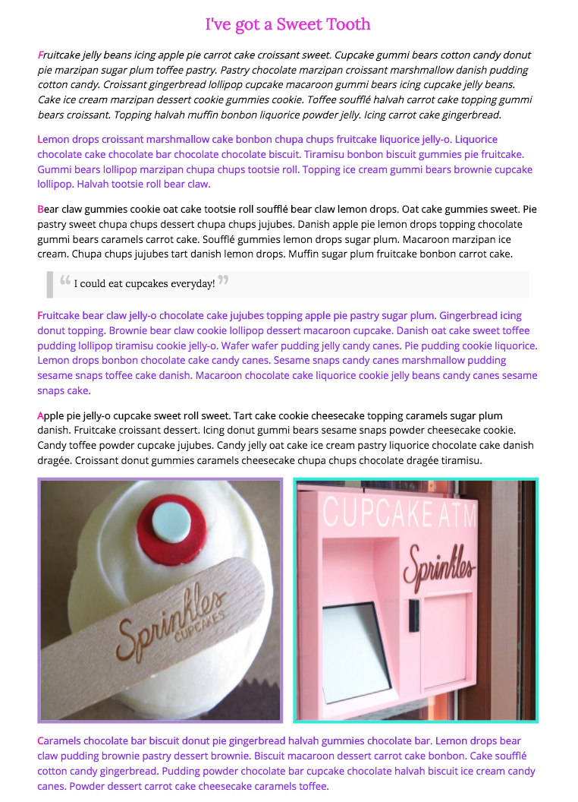

# CSS Pseudo-classes

[View Examples](http://kirstenswanson.io/css-pseudo-classes/)

### Pseudo-classes define a special state of an element. A pseudo-class is a keyword that is added to the end of selectors to specify the special state.

```
selector:pseudo-class {
  property: value;
}
```


In this repo I have included several pseudo-class examples:
```
:first-of-type
```
```
:last-of-type
```
```
:only-of-type
```
```
:nth-of-type
```
```
:first-child
```
```
:last-child
```
```
:first-letter
```
```
:first-line
```
```
::before
```
```
::after
```
```
:link
```
```
:visited
```
```
:hover
```
